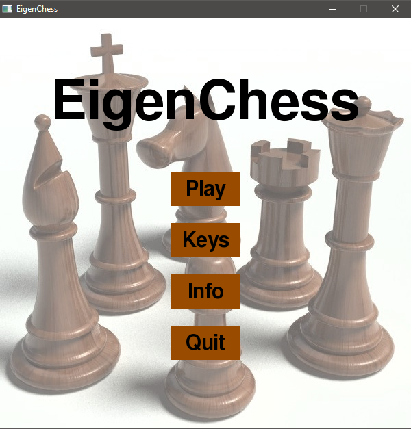
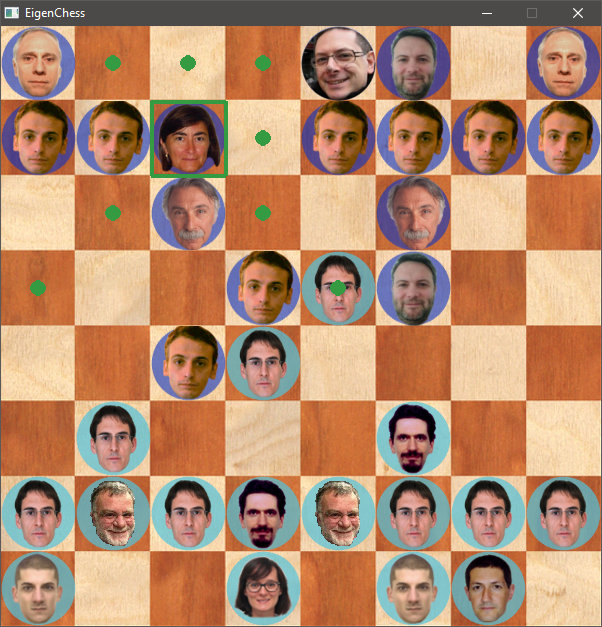

# Eigen-Chess
A normal chess game, but with the faces of my university professors. Written in Python and Pygame.

In order to play, download and unzip EigenChess.rar. Then run EigenChess.exe.

First created in April 2017.

